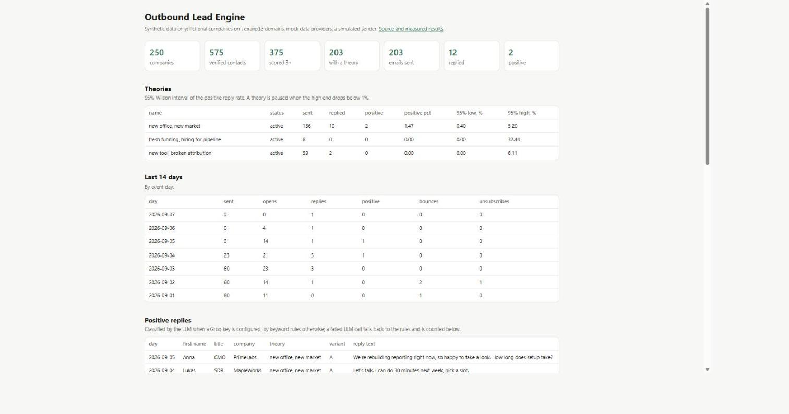
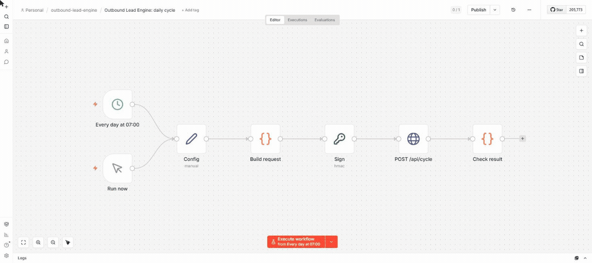
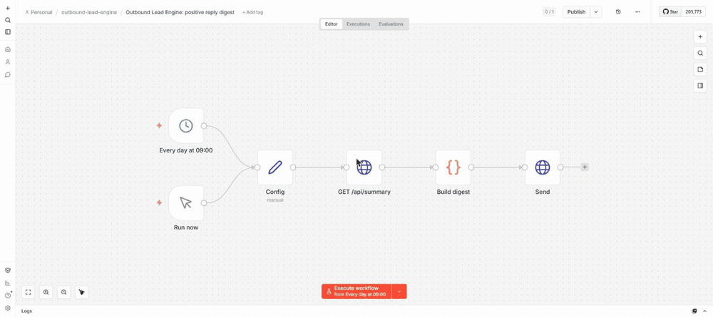

# Outbound Lead Engine

An outbound lead generation pipeline: company intake, an enrichment cascade that
calls the cheapest data provider first, lead scoring, a "why this person, why now"
hypothesis per segment, AI-written emails with validation, signed event ingest,
and a kill switch that turns off hypotheses that don't get replies.

**Demo mode by design.** Every company and person is fictional, every domain ends
in `.example` (reserved by RFC 2606, so no address can reach a mailbox), data
providers are mocks with the real APIs' response shapes, and sending is a
simulator. No real email is sent and no real person's data is processed. The
LinkedIn Sales Navigator module from the original design stays documentation only:
automating it breaks LinkedIn's terms and gets accounts banned.

**Live:** [outbound-lead-engine.vercel.app](https://outbound-lead-engine.vercel.app)
(dashboard), fed once a day by a scheduled GitHub Actions run: new emails written by
an LLM, the simulator's events delivered over HTTPS to the signed webhook, the kill
switch applied. All six stages are done; see [Roadmap](#roadmap).



*The dashboard on a local copy after 20 simulated days (template emails, keyword
reply classification). The live site shows the same views over its own, younger
database.*

## How it runs in production

```
GitHub Actions (daily cron)          n8n (optional, same thing)
  python -m leadengine cycle           POST /api/cycle, HMAC-signed
          │                                     │
          └────────────► one simulated day ◄────┘
                 score → signals → theory → email (Groq)
                 queue within mailbox limits → simulator
                 simulator events ──HTTPS, signed──► /api/events (Vercel)
                 kill switch on the Wilson upper bound
                              │
                     Neon Postgres ◄──── dashboard, /api/summary
```

| piece | where | notes |
|---|---|---|
| app (dashboard, webhook, cycle trigger) | Vercel, Python 3.12, FastAPI | `app.py` → `src/leadengine/web.py`; `/health`, `/api/events`, `/api/cycle`, `/api/summary` |
| database | Neon Postgres, `us-east-1`, next to Vercel's default region | migrations run by the scheduled job; the app uses the pooled URL |
| schedule | GitHub Actions `daily cycle` | `bootstrap` (idempotent) then `cycle --llm --copy-limit 20` |
| tests | GitHub Actions `tests` on every push | Postgres service container, memory-capped |
| orchestration | [`n8n/`](n8n) | two workflows, verified in n8n 2.16.1 |

Secrets live only in GitHub Actions secrets and Vercel environment variables:
`DATABASE_URL`, `WEBHOOK_SECRET`, `GROQ_API_KEY`.

## Stage 6: n8n workflows



*Both workflows imported into a real n8n 2.16.1 and run from the editor, against a local
copy of the app with a demo HMAC secret. The daily cycle: 20 emails written, 20 queued,
24 signed events delivered, all answered 200. The digest, below, after 20 simulated days:
2 positive replies posted to an incoming webhook.*



[`n8n/daily-cycle.json`](n8n/daily-cycle.json) signs `{"copy_limit": 20}` with
the Crypto node and POSTs it to `/api/cycle`; the HMAC secret sits in an encrypted
n8n credential, never in the workflow JSON (n8n 2.x also blocks `$env` in
expressions by default). [`n8n/positive-digest.json`](n8n/positive-digest.json)
reads `/api/summary` and posts the last two days of positive replies to a Slack or
Discord incoming webhook, and sends nothing when there are none.

Verified by `n8n import` + `n8n execute` in a throwaway, memory-capped n8n 2.16.1
container against a local copy of the app: two cycles wrote 20 emails each and
delivered 23 and 28 signed events, all answered 200; the digest posted the 2
positive replies of a 20-day simulation and stayed silent on a database without
any. Details and import steps: [`n8n/README.md`](n8n/README.md).

A cycle can start from two places, so it takes a lease on a row before it runs; a
second caller gets 409. A session advisory lock would not do: the app reaches Neon
through a transaction-mode pooler, where a session lock and its unlock can land on
different server connections.

## Stage 5: dashboard and deployment

The design's 12 Metabase cards became SQL views (`db/migrations/010_dashboard.sql`)
read by the app. Three were not carried over: the two about the LinkedIn account
pool (that module stays documentation) and "pipeline value", which needs an
average deal size the data does not have.

The first scheduled runs on the live stack: day 0 wrote 19 emails with Groq and
delivered 24 events, day 1 wrote 20 and delivered 28; every event was answered 200.
Of 20 leads on day 0, one email failed validation twice and went back to the queue,
as designed.

Things that broke on the way, all fixed:

- Vercel reads `.env.example` at import and pre-filled `DATABASE_URL` with the
  local `localhost:5433` value, so the first deploy answered 503 until it was
  replaced.
- Secrets piped into `gh secret set` from Windows PowerShell 5.1 got a UTF-8 BOM
  in front (psycopg: `invalid connection option`, with an invisible U+FEFF before `postgresql://`). Redirecting the file
  through `cmd` sends the bytes as they are.
- The dashboard answered 500 when the database was unreachable; it now renders a
  503 page and `/health` says `{"db": false}`.

## Stage 4: sending, events, and killing bad theories

Nothing is sent to a real inbox: a simulator stands in for the sending provider.
Each theory has a hidden true positive-reply rate the pipeline never sees; the
kill switch has to find the bad one from events alone. Events arrive as signed
webhooks through the same handler a real provider would call.

### The design's kill switch pauses good theories

The design paused a theory when the Wilson **lower** bound of its positive reply
rate was below 0.5% after 300 sends. A lower bound under the threshold means "we
cannot rule out that it is bad", not "it is bad". Here a theory is paused when the
**upper** bound is below 1%: we are 95% sure it is worse than 1%.

Monte Carlo, 2000 runs per cell, 50 sends a day, checked daily, up to 2000 sends
(`python -m leadengine killswitch-mc`):

| true positive rate | design: paused | design: sends at pause | here: paused | here: sends at pause |
|---|---|---|---|---|
| 0.25% (bad) | 100% | 300 | 99.6% | 600 |
| 0.5% (bad) | 99.9% | 300 | 78.1% | 900 |
| 1% (2x the design's threshold) | **82.9%** | 300 | 7.6% | 900 |
| 2% (4x) | **21.9%** | 300 | 0.1% | 400 |
| 3% (6x) | 3.1% | 300 | 0% | |

The design's rule kills most theories that work twice as well as its own threshold
and one in five that work four times as well. The upper-bound rule almost never
pauses a good theory and pays for it with sends: a 0.25% theory runs to 600 emails
instead of 300. The 7.6% at exactly 1% is above the nominal 2.5% because the rule is
checked every day, not once; a sequential test would fix that.

### The same thing in a 30-day simulated campaign

1500 companies, 3 mailboxes of 20 emails a day, replies classified by
`gpt-oss-20b`, run twice on the same world with only the rule changed. The simulator
seeds each recipient's behaviour by their email, so both runs see the same person
answer the same way.

| | upper bound (here) | lower bound (design) |
|---|---|---|
| bad theory (true 0.3%) | paused day 15, after 594 sends, 1 positive | paused day 8, after 321 sends, 1 positive |
| good theory (true 1.2%) | kept, 359 sends, 3 positive | **paused day 11**, after 307 sends, 2 positive |
| best theory (true 3%) | kept, 102 sends, 4 positive | kept, 102 sends, 4 positive |
| emails sent | 1055 | 730 |
| positive replies | 8 | 7 |
| webhooks rejected | 0 of 1615 | 0 of 1123 |
| replies classified as the simulator meant | 82 of 82 | 54 of 54 |

Both effects are visible: the design's rule stopped the bad theory 273 emails
sooner, and stopped the good one too. After that second pause only the 3% theory
was left: 511 unsent leads were released, almost none fitted it, and sending stopped
on day 12 while the upper-bound run kept sending until day 17. In this
world the good theory had few leads left, so the false kill cost one positive reply;
with a larger pool it would cost the pool. The reply classifier met replies it had
never seen (the simulator has its own text bank) and matched all 136, for $0.0041
per 82.

When a theory is paused, its leads that have not been handed to the sender go back
to theory assignment. In the upper-bound run 352 were released and 26 fitted
another theory; the rest went to `cold_reserve` with the reason.

### Webhook

`X-Signature: t=<unix>,v1=<HMAC-SHA256 of "t." + raw body>`. Differences from the
design's verifier, each with a test:

| in the design | here |
|---|---|
| on a bad signature it threw `Invalid HMAC signature, got X, expected Y`: whoever sent a forged request got the right signature back | the error says only which check failed |
| signed `JSON.stringify(parsed body)`, so a change in key order or whitespace broke valid webhooks | signs the raw bytes received |
| no timestamp: a captured webhook stayed valid forever | timestamp inside the signed bytes, 5-minute window, duplicates dropped by event id |
| any reply moved the lead to `replied`, including out-of-office | an out-of-office leaves the lead in `sent`; a reply after an unsubscribe or bounce does not undo it |
| pausing moved `queued` leads to another theory, although the sender already had their email | only leads not yet handed over move |
| "never pause the last active theory" was checked after the SQL had already paused it | checked before; the theory stays active |

Rejected requests are recorded with the reason and a hash of the body, never the
body itself.

### Theory generator

At the end of the simulation, `gpt-oss-120b` read the per-segment reply rates and
proposed three theories ("recent tech stack overhaul", "post-funding board
scrutiny", "accelerated hiring sprint") for $0.0004. The validator accepts only
signals the pipeline can fetch (the design allowed LinkedIn activity, which this
project does not automate), segment values that exist, and new names. Proposals are
stored as `draft`: a theory decides who gets emailed, so switching one on stays a
human decision.

## Stage 3: scoring, theories, emails, replies

LLM: Groq, `openai/gpt-oss-120b` for emails and `openai/gpt-oss-20b` for replies,
both with strict JSON schema output. Every answer is still validated in code,
because a schema guarantees the shape, not the content. All numbers below come
from real Groq runs; per-item results are in [`eval/results/`](eval/results).

### Emails: 30 leads through the whole pipeline on Groq

`python -m leadengine prepare --copy-limit 30 --dump` on the seed 42 world.

| | |
|---|---|
| valid on the first answer | 29 of 30 |
| valid after one repair | 1 (it used no fact from the lead's data) |
| rejected for good | 0 |
| average length | 48 words (limit 90) |
| cost | $0.0114 for 30 emails with two variants each, **$0.38 per 1000** |
| latency | 1.2 s per request |

The validator carries over the design's rules (subject of 6 words or fewer and
lowercase, body of 90 words or fewer and 3 paragraphs or fewer, ends with a
question, no placeholders, no "I hope this finds you well", no links, A differs
from B) and adds the one the design left to the prompt: **no invented facts**.
Every number in an email must appear in the lead's own data, and "our customers"
is rejected. The design's own sample email said "Three of our customers hired
their VP DG with us", a claim a recipient can check. A rejected answer goes back
to the model once with the reasons; after that the lead is retried on the next run
and moved to `dead_letter` after 3 attempts.

Read by eye, the emails are specific and factual. Two weaknesses the validator
does not catch: an unverifiable generalisation without a number ("seeing many SaaS
teams add HubSpot") passes, and almost every variant A opens with "I saw ...".

### Scoring: an LLM against a rubric it was given

The design scored every lead with an LLM. The rubric only uses fields that are
already structured (seniority, industry, size band, country), so here it is
computed in code, and the LLM scorer was measured against it on 60 leads with the
rubric written into its prompt:

| model | same score | within 1 | same send / don't send decision | cost per 1000 leads |
|---|---|---|---|---|
| `gpt-oss-20b` | 56.7% | 98.3% | 83.3% | $0.07 |
| `gpt-oss-120b` | 68.3% | 100% | 83.3% | $0.14 |

Nearly every disagreement is the model scoring one point lower: it uses the number
of matching criteria as the score (2 matches, score 2) although the prompt says 2
matches is 3. The smaller model also misread facts ("201-500" as not in the ICP,
"1000+" as a negative signal). With either model, **1 lead in 6 would change
between contacted and not contacted**. So scoring is code (`--scoring rules`, the
default), the LLM scorer stays as an option, and a failed LLM call falls back to
the rubric and is counted.

### Reply classification: 40 labelled replies

[`eval/replies.jsonl`](eval/replies.jsonl): six classes, including the design's
subtle cases ("busy right now" is neutral, "not interested and stop emailing me" is
unsubscribe, an out-of-office that names a colleague is not a referral).

| | accuracy | cost per 1000 replies |
|---|---|---|
| keyword rules (baseline) | 70% (28 of 40) | 0 |
| `gpt-oss-20b` | 100% (40 of 40) | $0.05 |
| `gpt-oss-120b` | 100% (40 of 40) | $0.11 |

The baseline fails on paraphrase: it misses 4 of 8 positive and 4 of 7 negative
replies, the two classes that matter most. Two
caveats about the 100%. The set was written by the same person as the prompt, so
it is likely easier than real replies. And 40 of 40 still leaves the true error
rate anywhere up to about 7%. A referral address must literally appear in the reply
(checked in code); the model returned the right address in all 4 replies that had
one, and null in the 2 that named a person without an address.

The design's classifier also returned a self-reported confidence. It is gone: on
an earlier project the model reported 1.00 on 36 of 40 answers, wrong ones
included.

### Where the money goes (seed 42, target 3)

| step | leads in | leads out | cost |
|---|---|---|---|
| enrichment | 250 companies | 721 contacts, 578 verified | $36.98 |
| scoring (rules) | 578 verified | 375 eligible, 203 below 3 | $0 |
| signals (funding, hiring, tools, news) | 166 companies | | $49.80 |
| theory assignment | 375 | 203 with a theory, 172 no theory fits | $0 |
| email | 203 | | $0.08 at the measured rate |

$0.43 per lead that reaches an email, and the email itself is 0.1% of that.
**Signals cost more than finding the people**, and they are bought for every
company with an eligible lead, although 172 of 375 leads then fit no theory.
Fetching only the signal the cheapest fitting theory needs, one at a time, is the
obvious next saving.

### Design bugs fixed in this stage

| in the design | here |
|---|---|
| scoring passed score 3, variable enrichment only took score 4, so every score-3 lead got a theory and waited forever | one threshold; a test takes a score-3 lead to `variables_ready` |
| a theory was assigned before its variables were fetched; a company without a funding round left the lead stuck | a theory is assigned only if the company has every variable it needs, otherwise `cold_reserve` with the reason |
| copy generation set status `generating_copy`, which the schema does not have | `drafting` |
| the reply classifier returns `referral`, which `events.reply_class` rejected | allowed; tested |
| theory assignment updated leads without a lock | `SKIP LOCKED` like every other step |
| signals were fetched per lead and theory | once per company; a test checks 3 leads cost 1 lookup |

Runs that die mid-step leave leads in `scoring` or `drafting`; the next run releases
claims older than 15 minutes and counts that as an attempt.

## Stage 2: enrichment cascade

Four data providers, cheapest first: Apollo, Hunter, Snov, PhantomBuster. Every
contact found is checked with Findymail before it counts. A more expensive provider
is called only while the cheaper ones have not produced `--target` verified
contacts for the company.

### Measured on the seed 42 world (250 companies, 882 people)

`python -m leadengine enrich --target N`, prices from the original design's cost
table (`src/leadengine/providers/clients.py`, one place). Runs are reproducible:
two runs give identical numbers.

| stopping rule | companies with a verified contact | verified leads | cost | per 1000 verified leads |
|---|---|---|---|---|
| `--target 1` (the design: stop at the first hit) | 235 of 250 | 426 | $17.30 | $40.62 |
| `--target 3` (default) | 235 of 250 | 578 | $36.98 | $63.98 |
| `--target 99` (call every provider) | 235 of 250 | 656 | $64.29 | $98.00 |

What the table says:

- **The design's rule already reaches every company that can be reached.** All
  three rules find a verified contact at the same 235 companies (the other 15 have
  nobody who verifies). The extra money buys depth, not coverage: 1.8 verified
  people per company at target 1, 2.5 at target 3.
- **The marginal lead gets expensive fast.** Going from target 1 to 3 adds 152
  verified leads for $19.68, $0.13 each. Going from 3 to "everything" adds 78 for
  $27.31, $0.35 each.
- **PhantomBuster is 46% of the bill for 12% of the contacts** at target 3: $17.00 of
  $36.98, 85 of 721 contacts kept. It charges per lead returned and returns everyone
  it knows at the company, including the people the cheaper providers already
  found: it returned 340 people, and 255 of them were duplicates that were paid for
  and thrown away. Apollo, for comparison, cost $7.33 for 458 contacts.
- **Verification is the second largest line**, $8.65 for 721 addresses. It is what
  keeps 93 risky (catch-all) and 50 invalid addresses out of sending: they are
  stored, but `leads_sendable` only returns verified ones.

### Same run with faults injected

`--rate-429 0.10 --rate-5xx 0.03 --phantom-empty 0.10`: one call in ten is rate
limited, three in a hundred fail with 503, and one PhantomBuster run in ten
finishes "successfully" with no data, which is what happens when its LinkedIn
session cookie expires.

| | clean | with faults |
|---|---|---|
| companies failed | 0 | 0 (one retried and succeeded on the next cycle) |
| calls | 2519 | 2895 |
| verified leads | 578 | 573 |
| companies with a verified contact | 235 | 234 |

429s and 503s cost only calls: retries absorbed all of them and no data was lost.
The 5 missing leads and the 1 lost company all come from the 14 silent empty
PhantomBuster runs. No error was raised for them; the only trace is the
`phantom empty runs` counter. That is the failure worth alerting on.

### How it is built

- **Mock providers** (`providers/mock.py`) answer from the synthetic world with the
  real APIs' awkward parts: Apollo search masks emails and each reveal is a separate
  billed `people/match`; Hunter pages by offset and returns role mailboxes with no
  name; Snov needs an OAuth token that expires in an hour and pages by `lastId`;
  PhantomBuster is launch, poll, fetch. Fault draws are seeded by the request
  itself, not by a shared sequence, so results do not depend on the order companies
  are processed in.
- **Retries** (`providers/http.py`) only for transport: 429 honours `Retry-After`
  (capped at 30 s), 5xx and network errors back off exponentially, at most 4
  attempts. Any other 4xx is raised at once. Failed attempts are logged but not
  billed.
- **Every loop has a bound that does not trust the API**: at most 10 pages per
  provider, a Snov cursor that does not advance stops the loop, PhantomBuster is
  polled at most 20 times, and one company cannot make more than 2000 calls.
- **Cost ledger** (`provider_calls`): one row per HTTP call, including failed ones.
  Per-person costs (reveal, per-lead fee, verification) are also on the lead;
  per-domain searches belong to the company and are only in the ledger.
- **Claims and failures**: a run claims a batch with `SKIP LOCKED` and commits the
  claim before any HTTP call. Everything found for a company is written in one
  transaction with its status and its ledger. A provider outage sends the company
  back to the queue, three failures move it to `dead_letter` once. A run that
  crashed leaves its companies claimed; the next run releases claims older than 15
  minutes and counts that as an attempt, so a company that crashes the process
  every time cannot loop forever.

### Tested (37 tests, mock over `httpx.MockTransport`, real Postgres)

Among them: two runs in parallel threads over 40 companies never call a provider
twice for the same company, and both runs really did work; a cascade with 30% of
calls rate limited stores exactly the same leads as a clean one; the expensive
provider is never called for a company the cheap ones cover; a person found by two
providers is stored and paid for once.

## Stage 1: schema and synthetic data

### Schema, with the original design's bugs fixed

The design this project implements had SQL that would have failed or misbehaved
in production. Each fix below is pinned by a test that runs on a real Postgres:

| Problem in the design | Fix | Test |
|---|---|---|
| Two overlapping runs claimed the same batch and paid for enrichment twice | `claim_companies` / `claim_leads` with `FOR UPDATE SKIP LOCKED` and the status flip in one statement | two open transactions claim 20 + 10 of 30 rows, no overlap |
| "Variables ready" aggregator used `COUNT(DISTINCT (subquery))` in `HAVING`, which Postgres rejects | JSONB containment: `required_variables <@ collected_keys` | full, partial and empty variable sets |
| `mark_lead_failed` inserted another dead letter row on every call after the limit | moves a lead to `dead_letter` exactly once, and back to an explicit retry status, never blindly to `new` | 6 failures: `[F, F, T, F, F, F]`, 1 row |
| The same person could be stored once per provider that found them | unique `(company_id, email)` | duplicate insert raises |
| Statuses were free text, a typo created a status nothing reads | `CHECK` constraints on every status | `'scroed'` is rejected |
| Suppression lookup lower-cased both sides and could not use the key | emails stored lower-case by constraint, plain equality | suppressed lead is not sendable |
| psql-only `\connect` and a non-idempotent `ALTER TABLE` broke any other runner and any re-run | plain SQL, re-runnable | second `migrate` applies nothing |

GDPR deletion removes a person's leads, events, variables and messages, and adds
the address to suppressions even when nothing was found, so a later import is
blocked too.

### Migration runner

Forward-only, one transaction per file, checksummed. An applied file that was
edited afterwards is refused. Writing its test caught a real bug: in psycopg 3 a
`transaction()` block inside an implicitly opened transaction is only a savepoint,
so a failing migration silently rolled back the ones before it. The runner now
requires an idle connection and the test proves a failure in file 2 keeps file 1.

### Synthetic world

`python -m leadengine generate --seed 42 --companies 250`, deterministic per seed.
Measured on seed 42:

| | |
|---|---|
| companies / people | 250 / 882 |
| intake rows (URLs, `www.`, upper case, emails, junk) | 398 |
| after normalisation | 250 inserted, 144 duplicates collapsed, 4 rejected as not a domain |
| second load | 0 inserted |
| people covered by at least one cheap provider (Apollo, Hunter, Snov) | 753 (85.4%) |
| people only the expensive provider has | 121 (13.7%) |
| people no provider has | 8 (0.9%) |
| email status valid / risky / invalid | 698 / 120 / 64 |
| role mailboxes (`info@`, `sales@`) / no last name | 44 (5.0%) / 80 (9.1%) |

Those last rows are what stage 2's cascade and verification have to handle.

## Running it

Requirements: Docker Desktop.

```powershell
docker compose -p outbound-lead-engine up -d        # capped local Postgres on :5433
copy .env.example .env
python -m leadengine migrate
python -m leadengine generate
python -m leadengine seed
python -m leadengine enrich --target 3            # add --rate-429 0.1 etc. to inject faults
python -m leadengine prepare --copy-limit 30 --dump   # needs GROQ_API_KEY
python -m leadengine eval-replies                  # 40 labelled replies against the LLM
python -m leadengine eval-scoring --n 60           # LLM score vs the rubric
python -m leadengine killswitch-mc                 # pause rules, Monte Carlo
python -m leadengine simulate --days 30 --classifier llm --propose
```

Live runs on this machine go through `.\scripts\run_live_capped.ps1 -WithDb -Command '...'`:
the same memory cap as the tests, a throwaway Postgres, and the Groq key passed
through the environment so it never appears on a command line.

`enrich` runs the whole queue against the in-process mock providers. Retry and
polling waits are added up instead of slept, and reported as simulated time.

Tests run only through the capped runner: the test container and a throwaway
Postgres both get a kernel-enforced memory limit, on a private Docker network, and
are removed afterwards.

```powershell
.\scripts\run_tests_capped.ps1
```

Current result: `157 passed`.

If an antivirus on your machine intercepts HTTPS (pip in the image fails with
`CERTIFICATE_VERIFY_FAILED`), run `.\scripts\export_local_ca.ps1` once. It exports
that root certificate to the git-ignored `.certs/`, and the build passes it to
`pip install` as a BuildKit secret. Verification stays on and the certificate is
not stored in the image.

## Roadmap

1. **Schema, migrations, synthetic data** (done)
2. **Mock providers with real response shapes, 429s and pagination; the enrichment cascade** (done)
3. **Scoring, theories and copy through an LLM with schema-validated output, fallbacks and evals** (done)
4. **Sending simulator, HMAC-signed event webhook with idempotency, Wilson-bound kill switch, theory generator** (done)
5. **Dashboard and deployment: Vercel, Neon, scheduled cycles in GitHub Actions** (done; the dashboard is FastAPI, not Next.js, because Vercel now runs a Python app as one function and mixing in Next.js needs a second build)
6. **n8n workflows orchestrating the same steps** (done)
