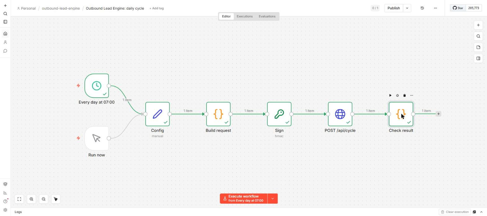
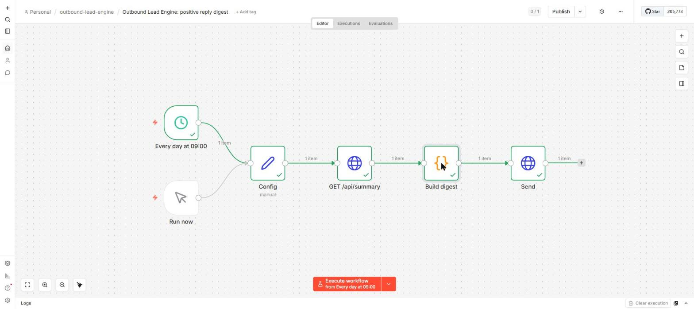

# n8n workflows

Two workflows that drive the deployed app from n8n. Both were imported with the n8n
CLI into a throwaway n8n 2.16.1 container and executed there against a local copy
of the app (see "Verified" below).

| file | what it does |
|---|---|
| `daily-cycle.json` | Every day at 07:00: builds `{"copy_limit": 20}`, signs it with HMAC-SHA256 (the Crypto node, secret from a credential), POSTs it to `/api/cycle`. A 409 means another cycle (GitHub Actions) is already running and is not an error; any other non-200, or a webhook event the server rejected, fails the execution. |
| `positive-digest.json` | Every day at 09:00: reads `/api/summary`, and if there are positive replies from the last 2 days, posts a digest to a Slack or Discord incoming webhook (`text` and `content` are both sent). No new replies, no message. |

Both are imported inactive. GitHub Actions already runs the daily cycle; turn the
n8n one on only if you switch the Actions schedule off, otherwise the second run of
the day just gets a 409.

## Import

1. Credentials → New → **Crypto**. Name it `Lead engine webhook secret`, put the
   deployment's `WEBHOOK_SECRET` into **Hmac Secret**.
2. Workflows → Import from file → `daily-cycle.json`, then `positive-digest.json`.
3. Open the Crypto node **Sign** and select the credential from step 1 (n8n keeps
   the reference by id, which differs between instances).
4. In `positive-digest`, set `notify_url` in the **Config** node to your incoming
   webhook. That URL is a secret; it lives in the workflow, so do not export the
   workflow back into a public repository after filling it in.

The secret is never in the workflow JSON: n8n 2.x blocks `$env` in expressions by
default, and a Crypto credential is stored encrypted.

## Verified

`n8n import:credentials` + `n8n import:workflow` + `n8n execute --id=...` in
`docker.n8n.io/n8nio/n8n` 2.16.1, memory-capped, on a private Docker network with
the app, a Postgres and an echo server:

- `daily-cycle`, run twice on a fresh database: day 0 wrote 20 emails, queued 20
  and delivered 23 signed events, all answered 200; day 1 wrote 20 more and
  delivered 28, all 200.
- `positive-digest` on a database with 20 simulated days: posted one message listing
  the 2 positive replies with company, theory and variant. On a database without
  positive replies it sent nothing.
